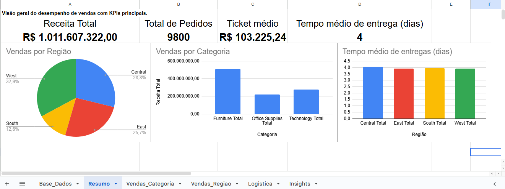
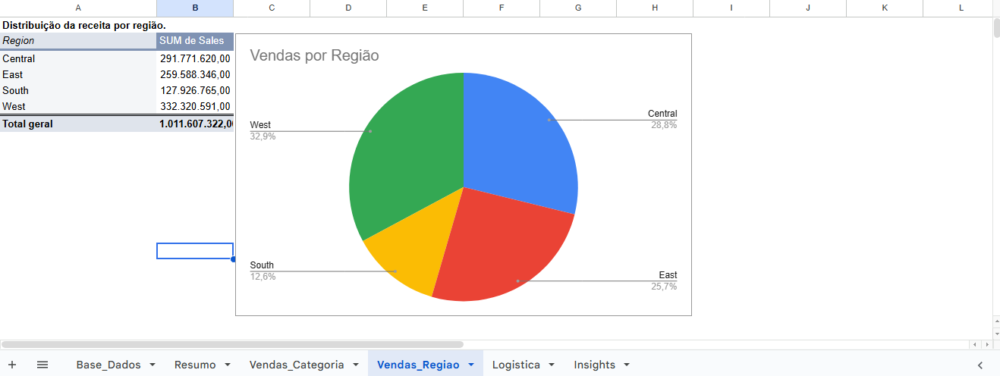
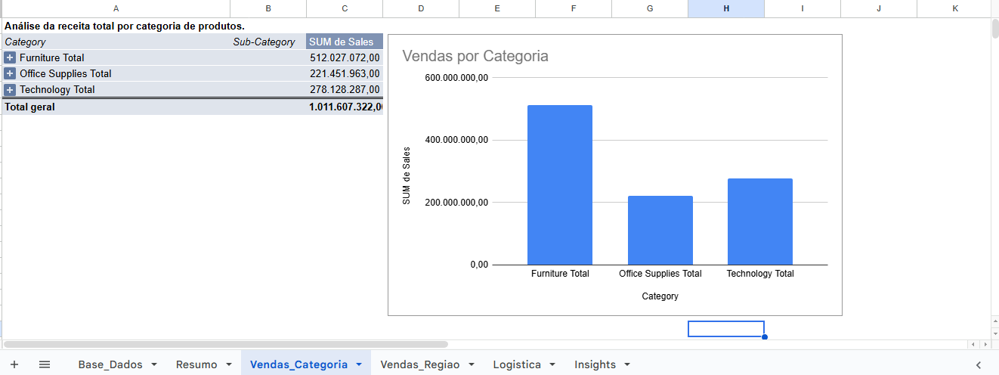
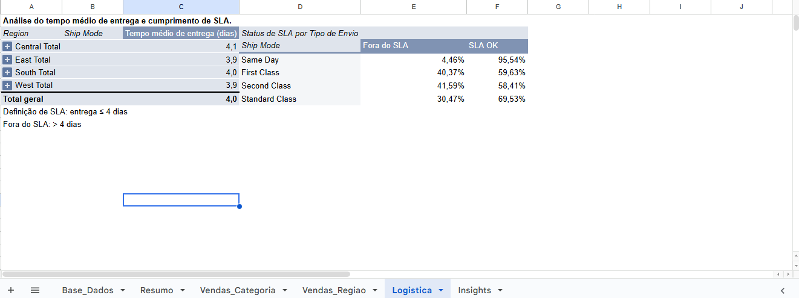

# analise-vendas-logistica
Análise de dados de vendas e logística com foco em SLA de entrega.

## Objetivo
Este projeto tem como objetivo analisar dados de vendas e logística de uma empresa fictícia,
identificando padrões de faturamento, desempenho por região e categoria de produtos,
além da eficiência logística por meio do cumprimento de SLA de entrega.

## Fonte dos Dados
Base de dados simulada de vendas corporativas, contendo informações de pedidos,
clientes, produtos, regiões e datas de envio e entrega.

## Análises Realizadas
- Receita total e número de pedidos
- Distribuição de vendas por região
- Distribuição de vendas por categoria e subcategoria
- Tempo médio de entrega por região
- Análise de SLA por modalidade de envio (Ship Mode)
- Comparação de entregas dentro e fora do SLA

## Principais Insights
- A região West concentra a maior parcela da receita total.
- A categoria Furniture lidera o faturamento, com destaque para subcategorias específicas.
- O tempo médio de entrega gira em torno de 4 dias, com pouca variação entre regiões.
- O método Same Day apresenta alto cumprimento de SLA.
- Second Class apresenta o pior desempenho percentual de SLA, indicando gargalos logísticos.

## Visualizações

### Dashboard Executivo

### Vendas por Região

### Vendas por Categoia

### Análise de SLA Logístico

## Ferramentas Utilizadas
- Google Sheets (limpeza, análise e visualização de dados)
- Tabelas dinâmicas
- Fórmulas avançadas (IFS, cálculo de SLA)

## Fonte dos Dados

A planilha utilizada neste projeto está disponível no Google Sheets:
https://docs.google.com/spreadsheets/d/1o41ceAk0R9bqUuZ_LcIqP2y9yjaeuMIIeS9k22W90JI/edit?usp=sharing

